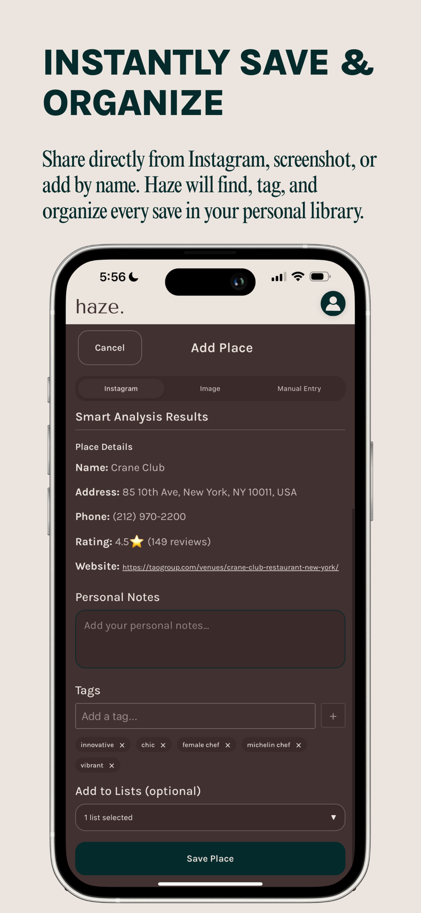

# haze.

A social place discovery app for iOS that helps you save, organize, and share your favorite restaurants and places — with AI that does the work of extracting details from Instagram posts and screenshots.

> **Note:** This is a showcase repo. Haze is a for-profit app currently in TestFlight beta — source code is in a private repository.

<!--  -->

## What It Does

You see a restaurant on Instagram and you want to remember it. Instead of manually searching and saving, Haze lets you:

1. **Share an Instagram post or screenshot** — AI (OpenAI GPT-4o) extracts the place name, location, tags, and details automatically
2. **View your places on a map** or in a searchable, filterable list
3. **Organize into collections** — create custom lists like "Date Night" or "Brunch Spots"
4. **Share with friends** — send places, share lists, and see what your friends are saving

## Tech Stack

| Layer | Technology |
|-------|-----------|
| **Frontend** | React 18, Vite |
| **Mobile** | Capacitor (native iOS), Share Extension, Push Notifications |
| **Backend** | Supabase (PostgreSQL + Auth + Edge Functions + Realtime) |
| **AI** | OpenAI GPT-4o via Supabase Edge Functions |
| **Maps** | Google Maps JavaScript API, Google Places API |
| **Analytics** | PostHog |
| **Deployment** | Netlify (PWA), TestFlight (iOS) |

## Key Technical Features

### AI-Powered Place Extraction
- **Instagram URL analysis**: paste a link, GPT-4o extracts the place from the post caption and comments
- **Screenshot analysis**: upload a screenshot of a review or recommendation, GPT-4o parses the image to identify the place
- **Auto-tagging**: AI generates relevant tags (cuisine type, vibe, price range) based on context
- All API calls routed through Supabase Edge Functions — no keys exposed to the client

### Native iOS Integration
- Built with Capacitor for native iOS deployment
- **iOS Share Sheet**: custom Share Extension lets users share directly from Photos or Instagram into Haze
- **App Groups** for secure data transfer between Share Extension and main app
- **Universal Links**: deep linking to shared places and lists
- Push notifications, haptic feedback, safe area support

### Maps & Location
- Interactive Google Maps with place pins and user geolocation
- Toggle between map view and list view
- Google Places autocomplete for manual place addition
- Place details enriched with hours, ratings, reviews, and photos

### Social Features
- Friend system with username search and friend requests
- Share individual places or entire lists with friends
- Activity feed showing what friends are saving
- Universal link sharing for deep linking

### Data Layer
- Supabase PostgreSQL with Row-Level Security for user data isolation
- JSONB fields for rich metadata (source data, hours, AI analysis results)
- Realtime subscriptions for live updates
- Edge Functions for all external API calls with auth token validation

## Architecture

```
User → React Frontend (Vite)
         ├── Supabase Auth (email/password)
         ├── Supabase PostgreSQL (places, lists, profiles, friendships)
         ├── Supabase Edge Functions
         │     ├── extract-place-info → OpenAI GPT-4o
         │     ├── google-places → Google Places API
         │     └── google-photo-proxy → Place photos
         ├── Google Maps JS SDK (map UI, autocomplete)
         └── Capacitor → Native iOS
               ├── Share Extension (App Groups)
               ├── Push Notifications
               ├── Universal Links
               └── Geolocation
```

## Status

Currently in TestFlight beta. Core features — AI place extraction, map/list views, collections, friend sharing, and iOS native integration — are all working in production.
